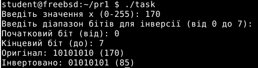

# **ЗАВДАННЯ (Варіант №23)**

> **Умова:**  
> Напишіть програму на ANSI C, яка інвертує біти беззнакового символьного значення `x` та зберігає результат у `y`.  
> Результат виводиться у двійковій та десятковій формах.  
> Реалізуйте можливість інвертації лише певного діапазону бітів, заданого як параметри.

---

## **Опис реалізації**

Програма написана на мові **C**, використовує тип `uint8_t` для представлення 8-бітного беззнакового значення `x`.  
Користувач вводить значення `x` у межах від 0 до 255, а також діапазон бітів **[від, до]**, які потрібно інвертувати.

Інверсія реалізована за допомогою створення **маски з одиниць** у заданому діапазоні бітів. Ця маска XOR’иться зі значенням `x`, утворюючи результат `y`.

У програмі також є функція `print_binary()`, яка виводить число у двійковому вигляді зліва направо (MSB → LSB).

---

## **Результат роботи**

