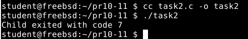

# Приклад 2.7 та 2.8 Dumb Shell
**Умова**
>Створити просту оболонку, яка запускає команди користувача. Скомпілювати та запустити програму.
# Пояснення
Цей код створює просту оболонку, яка в циклі зчитує команду користувача, виводячи запрошення "dumbsh".  Програма завершується, коли викликається «вихід».  Інакше використовується fork(), щоб створити новий процес.  За допомогою execlp() введена команда виконується в дочірньому процесі, а в разі помилки виводиться повідомлення.  Батьківський процес чекає, поки дочірній завершиться.  Таким чином, кожна команда виконує свій власний процес, і коли процес закінчується, оболонка знову приймає нову команду.

**Результат виконання**

# Приклад 2.9 API wait — деталі
**Умова**
>wait() — чекає на будь-який дочірній процес.
>waitpid(pid, ...) — чекає на конкретний PID.
>WNOHANG — не блокує, якщо дитина ще не завершилась.
# Пояснення
Цей код використовує fork(), щоб створити дочірній процес.  У дочірньому процесі виконується _exit(7), що означає завершення коду 7.  Батьківський процес використовує waitpid(), щоб очікувати завершення дитини, після чого перевіряє, чи була дитина успішно завершена (WIFEXITED), і виводить код завершення через WEXITSTATUS.  Таким чином, програма виведе:
> Child exited with code 7

**Результат виконання**

# Завдання на практику (Варіант 23)
**Умова**
>Напишіть програму, яка створює 3 дочірніх процеси і чекає їх завершення в довільному порядку.
# Пояснення
Була реалізована програма, яка демонструє одночасне існування кількох дочірніх процесів, обробку їх завершення у довільному порядку та вивід відповідних повідомлень у батьківському процесі. Це дозволяє краще зрозуміти концепцію розгалуження процесів, механізм fork(), роботу з PID та базову синхронізацію за допомогою wait().
**Результат виконання**

