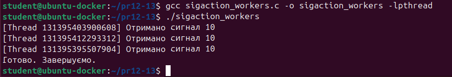
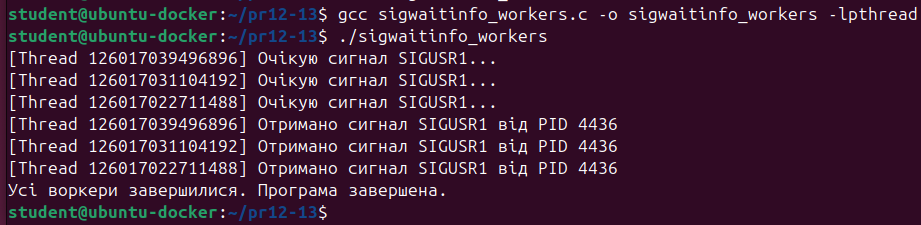
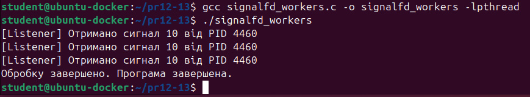

# Завдання (Варіант 23)
**Умова**
>Напишіть декілька воркерів, які працюють паралельно й обробляють сигнали, що надходять одночасно, і порівняйте продуктивність між sigaction, sigwaitinfo та signalfd.

# Пояснення
Було розглянуто різні способи обробки сигналів у багатопотокових програмах. 
На першому етапі було реалізовано приклад з використанням класичного підходу через sigaction. У програмі створюється три потоки за допомогою бібліотеки pthread. Кожен потік очікує сигнал SIGUSR1, при надходженні якого викликається глобальна функція-обробник, яка друкує повідомлення з номером сигналу та ідентифікатором потоку. Для демонстрації роботи головний потік надсилає сигнал SIGUSR1 кожному воркеру за допомогою pthread_kill. Усі воркери отримують сигнал, обробляють його і виводять відповідне повідомлення. Цей підхід є найпростішим, проте він не забезпечує гнучкого керування потоками, оскільки сигнал обробляється асинхронно, і складно контролювати черговість виконання.

Наступним прикладом було використання функції sigwaitinfo, яка дозволяє потокам синхронно очікувати сигналів. У кожному з трьох потоків формується маска сигналів і викликається sigwaitinfo, що блокує потік до надходження SIGUSR1. Як тільки сигнал надходить, потік відновлюється і виводить повідомлення з інформацією про сигнал, включно з PID відправника. У цьому прикладі кожен потік самостійно обробляє сигнал, що дає більше контролю над поведінкою програми. Головний потік так само надсилає три сигнали SIGUSR1. Такий підхід є зручним для багатопотокових додатків, де потрібне точне управління моментом обробки сигналу.

Третім методом стала реалізація через signalfd, який є специфічним для Linux. Особливістю цього способу є те, що сигнали потрапляють у файловий дескриптор, з якого їх можна читати як звичайні дані. У програмі створюється один потік-обробник, який блокує сигнал SIGUSR1 у всій програмі і потім читає сигнали з дескриптора. Головний потік надсилає три сигнали, і потік-обробник тричі виконує read, отримуючи всю необхідну інформацію. Цей підхід дозволяє централізовано збирати сигнали, що особливо корисно в масштабованих серверних програмах, де зручно працювати з сигналами через мультиплексори poll або epoll.

Усі три реалізації були успішно скомпільовані та протестовані. В результаті стало зрозуміло, що sigaction є простим, але менш гнучким способом, sigwaitinfo дозволяє точну синхронну обробку сигналів у кожному потоці, а signalfd надає найсучасніший і масштабований механізм для роботи з сигналами, особливо у випадках, коли потрібна інтеграція з іншими I/O подіями.
