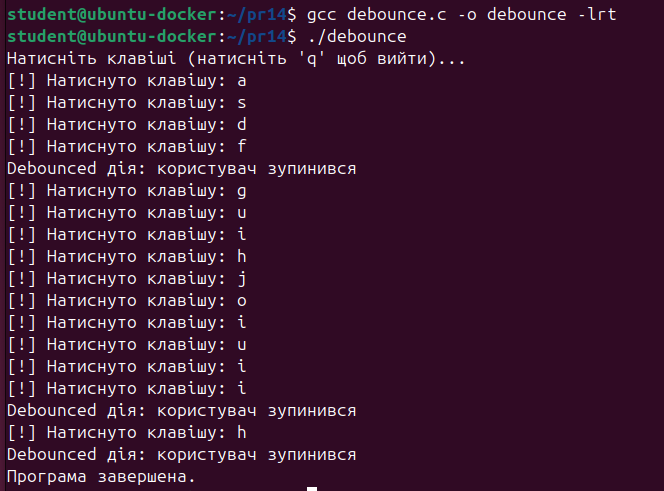

# Завдання
**Умова**
>Реалізуйте механізм "debounce" для подій, що надходять від користувача (наприклад, клавіатура) через POSIX-таймер.
# Пояснення
було створено програму мовою C, яка працює у терміналі в неканонічному режимі введення, тобто зчитує символи одразу після натискання, не чекаючи натискання Enter. При кожному натисканні клавіші програма миттєво виводить повідомлення про те, що користувач натиснув клавішу, а також перезапускає POSIX-таймер. Таймер налаштований на одноразовий запуск із періодом 500 мс. Якщо протягом цього часу не відбувається жодної нової події, таймер спрацьовує, і викликається обробник сигналу, який виводить повідомлення, що користувач "заспокоївся" — тобто завершив вводити.
Для реалізації було використано функції timer_create, timer_settime і сигнал SIGRTMIN, до якого прив’язано обробник через sigaction. Усі дії таймера відбуваються незалежно від основного потоку, що дозволяє легко контролювати стан введення. Таким чином, поки користувач натискає клавіші — таймер кожного разу перезапускається, і ніякого "завершального" сигналу не надходить. Але варто зробити паузу, як через 0.5 секунди з’являється повідомлення про debounce-реакцію.

**Результат виконання**

