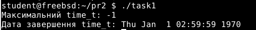
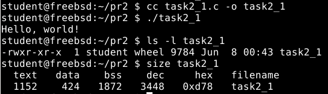
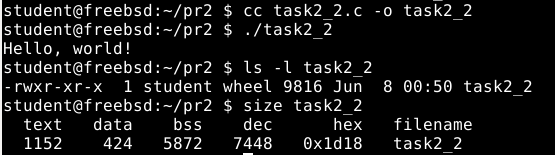
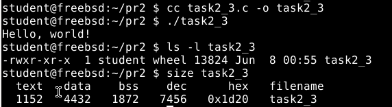
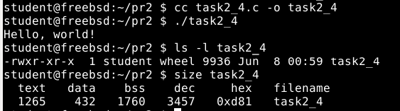
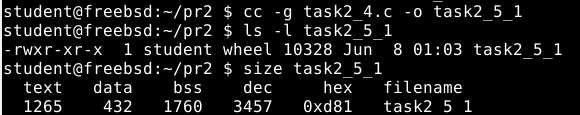
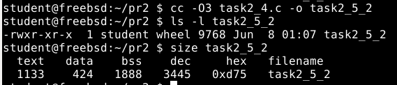
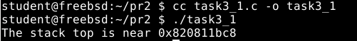
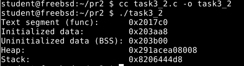
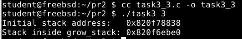

## ЗАВДАННЯ 1

> **Умова:**
>Напишіть програму для визначення моменту, коли time_t закінчиться. Дослідіть, які зміни >відбуваються в залежності від 32- та 64-бітної архітектури. Дослідіть сегменти виконуваного файлу.

## **Пояснення програми**
Ця програма визначає максимальне значення типу time_t шляхом зсуву найстаршого біта типу на основі його розміру у байтах. Тип time_t використовується для представлення часу у вигляді кількості секунд, що минули з 1 січня 1970 року. Залежно від розрядності системи (sizeof(time_t) дорівнює 4 або 8 байт), програма показує різні результати:
- на 32-бітній архітектурі — дата обмежується 19 січня 2038 року;
- на 64-бітній — значення сягає десятків мільярдів років у майбутнє.

Функція ctime() перетворює числове значення time_t у зрозумілий текстовий формат дати й часу. Якщо значення занадто велике, функція повертає NULL, що свідчить про вихід за межі оброблюваних значень.

Програма також дозволяє візуалізувати наслідки переповнення — коли time_t досягає межі і переходить у від’ємне значення.

### Результат роботи програми (Завдання 1):

## ЗАВДАННЯ 2

> **Умова:**  
> Розгляньте сегменти у виконуваному файлі.  
> 1. Скомпілюйте програму "hello world", запустіть ls -l для виконуваного файлу, щоб отримати його загальний розмір, і запустіть size, щоб отримати розміри сегментів всередині нього.
> 2. Додайте оголошення глобального масиву із 1000 int, перекомпілюйте й повторіть вимірювання. Зверніть увагу на відмінності.
> 3. Тепер додайте початкове значення в оголошення масиву (пам’ятайте, що C не змушує вас вказувати значення для кожного елемента масиву в ініціалізаторі). Це перемістить масив із сегмента BSS у сегмент даних. Повторіть вимірювання. Зверніть увагу на різницю.
> 4. Тепер додайте оголошення великого масиву в локальну функцію. Оголосіть другий великий локальний масив з ініціалізатором. Повторіть вимірювання. Дані розташовуються всередині функцій, залишаючись у виконуваному файлі? Яка різниця, якщо масив ініціалізований чи ні?
> 5. Які зміни відбуваються з розмірами файлів і сегментів, якщо ви компілюєте для налагодження? Для максимальної оптимізації?
> Проаналізуйте результати, щоб переконатися, що:
> ● сегмент даних зберігається у виконуваному файлі;
> ● сегмент BSS не зберігається у виконуваному файлі (за винятком примітки щодо його вимог до розміру часу виконання);
> ● текстовий сегмент більшою мірою піддається перевіркам оптимізації;
> ● на розмір файлу a.out впливає компіляція для налагодження, але не сегменти.
## **Пояснення програми:**

- task2_1.c:  
  Базова програма без глобальних або локальних змінних. У виконуваному файлі міститься тільки текстовий сегмент.
  
**Результат роботи програми:**

- task2_2.c:  
  Масив потрапляє у сегмент BSS, який не зберігається у виконуваному файлі, але резервується в пам'яті під час виконання. Розмір ELF-файлу при цьому змінюється незначно або зовсім не змінюється.

**Результат роботи програми:**

- task2_3.c:  
  Переміщається в сегмент DATA, який зберігається у виконуваному файлі. Це призводить до збільшення розміру виконуваного файлу.

**Результат роботи програми:**

- task2_4.c:  
  Розміщуються у стеку, тому не змінюють структуру або розміри сегментів ELF-файлу. Ініціалізований локальний масив може незначно вплинути на розмір text-сегменту, але незначно.

**Результат роботи програми:**

- 5_1, 5_2:  
  Компіляція з параметром -g значно збільшує розмір виконуваного файлу через включення debug-інформації. Компіляція з -O3 зменшує text-сегмент завдяки оптимізації коду, але не впливає на розміри сегментів BSS і DATA.

**Результат роботи програми:**

## ЗАВДАННЯ 3

> **Умова: **
> Скомпілюйте й запустіть тестову програму, щоб визначити приблизне розташування стека у вашій системі:
> 
> #include <stdio.h>
> 
> int main() {
 >    int i;
    printf("The stack top is near %p\n", &i);
    return 0;
> }
> 
> Знайдіть розташування сегментів даних і тексту, а також купи всередині сегмента даних, оголосіть змінні, які будуть поміщені в ці сегменти, і виведіть їхні адреси.
Збільшіть розмір стека, викликавши функцію й оголосивши кілька великих локальних масивів. Яка зараз адреса вершини стека?
> 
> Примітка: стек може розташовуватися за різними адресами на різних архітектурах та різних ОС. Хоча ми говоримо про вершину стека, на більшості процесорів стек зростає вниз, до пам’яті з меншими значеннями адрес.

**Результат роботи тестової програми:**

 

# Пояснення програми task3_2.c:
Код досліджує розташування різних сегментів пам’яті:
Адреса функції func — показує розташування текстового сегмента.
global_var — ініціалізована глобальна змінна - сегмент DATA.
global_bss — неініціалізована глобальна змінна - сегмент BSS.
static_var — статична змінна - сегмент DATA.
local_var, arr1, arr2 — локальні змінні - стек.
malloc() пам’ять на купі (heap).

**Результат роботи програми task3_2.c:**

 

# Пояснення програми task3_3.c:
У коді досліджується, як змінюється розташування вершини стека при виділенні великих локальних масивів. На початку виводиться адреса змінної i у main, що вказує на початкове розташування стека. Після виклику функції func, де оголошені масиви arr1 і arr2, адреса вершини стека зсувається вниз (у більшість архітектур стек зростає до нижчих адрес). Це ілюструє динамічний характер використання стека під час виконання програми.
**Результат роботи програми task3_3.c:**

 

**Отже:**
Сегмент тексту містить машинний код функції (адреса func).
Сегмент даних містить ініціалізовані глобальні/статичні змінні.
Сегмент BSS — для глобальних неініціалізованих змінних.
Стек змінюється в межах високих адрес і зменшується при глибших викликах.
Купа зростає в напрямку більших адрес (malloc-виділена пам’ять).
