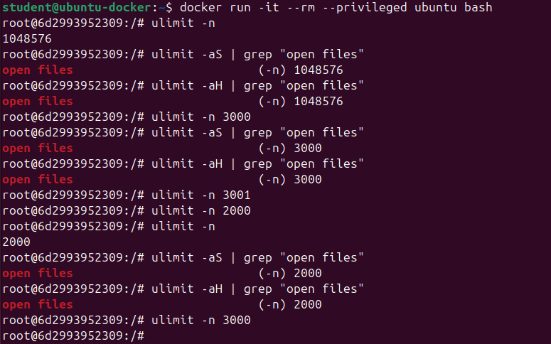

# ЗАВДАННЯ 1:
**Умова:**
> Запустіть Docker-контейнер і поекспериментуйте з максимальним лімітом ресурсів відкрити[
>  файлів. Для цього виконайте команди у вказаному порядку:
>
> $ ulimit -n
> $ ulimit -aS | grep "open files"
> $ ulimit -aH | grep "open files"
> $ ulimit -n 3000
> $ ulimit -aS | grep "open files"
> $ ulimit -aH | grep "open files"
> $ ulimit -n 3001
> $ ulimit -n 2000
> $ ulimit -n
> $ ulimit -aS | grep "open files"
> $ ulimit -aH | grep "open files"
> $ ulimit -n 3000
>
> Як наступне вправу, повторіть перераховані команди з root-правами.

# Хід роботи
Для виконання цього завдання було встановлено UbuntuDocker на Virtual Box. Після цього запускаємо у терміналі контейнер і вводимо команди з умови:

> docker run -it --rm ubuntu bash

У результаті маємо, що змінювати ліміти ми можемо лише вниз. Для підвищення не вистачає прав.

Потім виходимо з контейнера та запускаємо його повторно, але з параметром --privileged, щоб отримати root-права.

> docker run -it --rm --privileged ubuntu bash

Тобто за допомогою root-прав можемо як понижувати так і підвищувати ліміти.

# ЗАВДАННЯ 2:
**Умова:**
> У Docker-контейнері встановіть утиліту perf(1). Поекспериментуйте з досягненням процесом
> встановленого ліміту.

# Хід роботи

Запускаємо контейнер та встановлюємо perf за допомогою команди:

> apt update && apt install -y linux-tools-common linux-tools-generic linux-tools-$(uname -r)

Також після цього перевіряємо встановлення perf за допомогою perf --version та встановлюємо ліміт на кількість запущених процесів:

Далі за допомогою команди nano test.sh створюємо та редагуємо скрипт.

Після збереження файлу, запускаємо його за допомогою nohup ./test.sh &. ./test.sh запускає сам скрипт, & - робить запуск фоновим, а nohup ігнорує ввід та перенаправляє вивід скрипта у файл nohup.out замість виводу в bash.

Після цього запускаємо
> perf top -p $(pgrep -d',' -f test.sh)

Для того, щоб побачити скільки ресурсів займає скрипт test.sh. perf top відображає всі активні процес та скільки ресурсів займає кожен з них наживо, -p фільтрує вивід за конкретним процесом, а pgrep -d',' -f test.sh знаходить всі процеси, що мають test.sh в імені та виводить їх PID.

# ЗАВДАННЯ 3:
**Умова:**
> Напишіть програму, що імітує кидання шестигранного кубика. Імітуйте кидки, результати
> записуйте у файл, для якого попередньо встановлено обмеження на його максимальний розмір (max
> file size). Коректно обробіть ситуацію перевищення ліміту.

# Хід роботи

Для початку запустимо контейнер та встановимо gcc та nano за допомогою команд:
> apt update
> apt install gcc && apt install nano

та перевіримо встановлення за допомогою --version

Далі скомпілюємо та запустимо програму. Після запуску програма починає імітувати кидання кубика та записувати дані у файл dice_results.txt поки користувач не зупинить програму за допомогою Ctrl + C або поки файл не заповниться. Якщо файл заповниться буде запропоновано очистити його або зупинити програму.

Також за бажанням можемо зупинити у процесі за допомогою Ctrl + C:

Можемо також переглянути вміст файлу dice_results.txt за допомогою команди cat results.txt

Перевіримо розмір файлу за допомогою ls -lh results.txt

# ЗАВДАННЯ 4:
**Умова:**
> Напишіть програму, що імітує лотерею, вибираючи 7 різних цілих чисел у діапазоні від 1 до 49 і
> ще 6 з 36. Встановіть обмеження на час ЦП (max CPU time) і генеруйте результати вибору чисел
> (7 із 49, 6 із 36). Обробіть ситуацію, коли ліміт ресурсу вичерпано.

# Хід роботи
Для початку запускаємо Docker та встановлюємо gcc та nano для написання програми, яка тестує механізми обмеження системних ресурсів у Linux. У цій програмі за допомогою функції getrlimit виводяться поточні ліміти для різних ресурсів процесу, таких як час використання процесора, максимальний розмір файлу, розмір сегменту даних, розмір стеку, розмір core-файлів, кількість відкритих файлів, максимальний обсяг пам’яті (address space) тощо. Для кожного з ресурсів викликається функція print_limit, яка виводить на екран поточні значення soft та hard обмежень. Таким чином, програма дозволяє переглянути, які саме обмеження ресурсів встановлені для поточного процесу у системі. Це демонструє роботу із системними ресурсами та їх обмеженнями в середовищі Linux, що є одним із методів керування ресурсами операційної системи.

# ЗАВДАННЯ 5:
**Умова:**
> Напишіть програму для копіювання одного іменованого файлу в інший. Імена файлів передаються у
> вигляді аргументів. Програма має:
>   перевіряти, чи передано два аргументи, інакше виводити "Program need two arguments";
>   перевіряти доступність першого файлу для читання, інакше виводити "Cannot open file ....
> for reading";
>   перевіряти доступність другого файлу для запису, інакше виводити "Cannot open file .... for
> writing";
>   обробляти ситуацію перевищення обмеження на розмір файлу.

# Хід роботи
Імена вхідного файлу (джерела) і вихідного файлу (призначення) є двома аргументами, які приймає програма.  Програма завершує роботу з повідомленням: «Program need two arguments», якщо кількість аргументів неправильна.  Спочатку програма намагається відкрити вхідний файл, який можна прочитати.  Вона виводить повідомлення: «Неможливо відкрити файл [ім'я_файлу] для читання» і завершує роботу, якщо файл недоступний.  Після цього вона намагається відкрити записний файл.  Якщо файл неможливо відкрити для запису, програма виводить повідомлення: «Неможливо відкрити файл [ім'я_файлу] для написання» і завершує роботу. Далі починає копіювання.  Дані записуються у вихідний файл після того, як вони зчитуються з вхідного файлу блоками розміром 1024 байти.  Програма перевіряє, чи не перевищено встановлений розмір файлу (1 MB) під час кожного запису.  Якщо загальний розмір вихідного файлу перевищує цей обмеження, програма виводить повідомлення: «Error: File size limit exceeded while writing to [ім'я_файлу]» і припиняє роботу.  Якщо копіювання було завершено успішно, програма видасть повідомлення: «Файл успішно скопійовано з [вхідний_файл] до [вихідний_файл].»

Якщо із файлом щось не так, то видає відповідне повідомлення:

Вміст файлі source.txt та destination.txt:

# ЗАВДАННЯ 6:
**Умова:**
> Напишіть програму, що демонструє використання обмеження (max stack segment size). Підказка:
> рекурсивна програма активно використовує стек.

# Хід роботи
Ця програма має рекурсивну функцію для перевірки max stack segment size. Перед запуском доречно встановити ліміт на сегмент стека за допомогою
> ulimit -s 255

Після досягнення ліміту отримуємо Segmentation fault (core dumped)

# ЗАВДАННЯ 7:
**Умова:**
> Написати програму, яка тестує різні методи обмеження ресурсів у Linux.

# Хід роботи
Для початку запускаємо Docker та встановлюємо gcc та nano для написання програми, яка демонструє використання різних методів обмеження ресурсів у Linux. У даній програмі використовується системний виклик getrlimit для отримання поточних лімітів на основні ресурси процесу. Зокрема, програма перевіряє обмеження на використання процесорного часу, максимальний розмір файлів, розмір сегменту даних, розмір стеку, розмір core-файлів, розмір оперативної пам’яті (resident set), кількість відкритих файлів та максимальний доступний об’єм пам’яті (address space). Для кожного ресурсу викликається функція print_limit, яка зчитує та виводить soft та hard значення обмежень. Таким чином, програма дозволяє отримати повну інформацію про поточний стан обмежень системних ресурсів для запущеного процесу. Такий підхід дає змогу контролювати розподіл ресурсів у багатозадачних системах та забезпечувати стабільну роботу програм у середовищі Linux.

