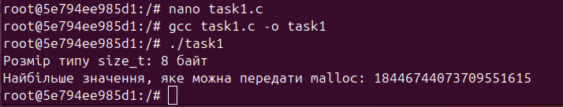
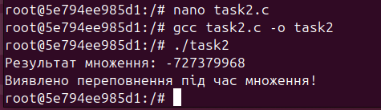
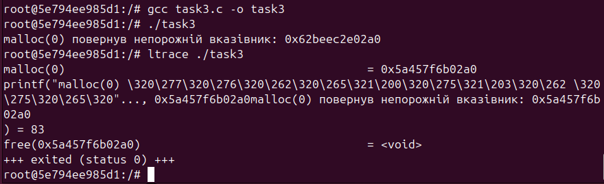
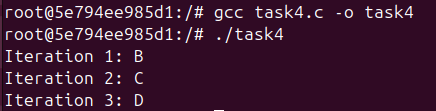
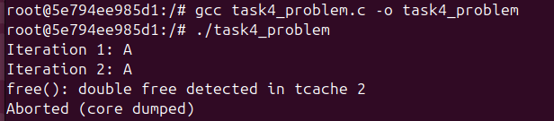
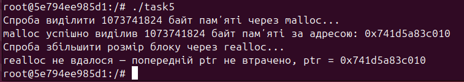
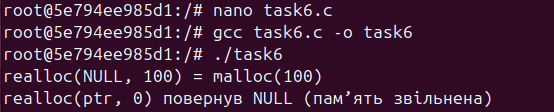
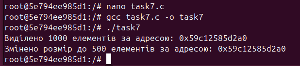
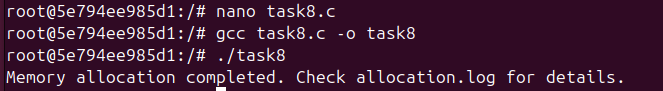
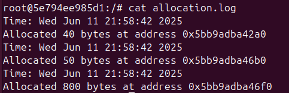

# Завдання 1
**Умова**
> Скільки пам’яті може виділити malloc(3) за один виклик?
> Параметр malloc(3) є цілим числом типу даних size_t, тому логічно максимальне число, яке можна передати як параметр malloc(3), — це максимальне значення size_t на платформі (sizeof(size_t)). У 64-бітній Linux size_t становить 8 байтів, тобто 8 * 8 = 64 біти. Відповідно, максимальний обсяг пам’яті, який може бути виділений за один виклик malloc(3), дорівнює 2^64. Спробуйте запустити код на x86_64 та x86. Чому теоретично максимальний обсяг складає 8 ексабайт, а не 16?

# Хід роботи
Тип size_t, який на 64-бітній системі складає 8 байт (64 біти), теоретично визначає кількість пам’яті, яку можна передати в malloc().  Це може адресувати максимум 264 байт або 16 ексабайт.  Але через ряд обставин обмеження на практиці значно менші.  Сучасні 64-бітні процесори, такі як x86_64, адресують пам'ять лише за 48 бітами, що обмежує кількість віртуальної пам'яті до 256 терабайт.  Хоча деякі нові процесори підтримують 57 біт, що дозволяє обробляти до 128 петабайт, повна 64-бітна адресація не використовується.  Крім того, операційні системи накладають додаткові обмеження, а фізична пам'ять часто перевищує теоретичні обмеження.  Таким чином, максимальний розмір пам'яті на практиці обмежений 8 ЕБ або навіть менше, хоча malloc() теоретично може виділити до 16 ЕБ.

# Завдання 2
**Умова**
> Що станеться, якщо передати malloc(3) від’ємний аргумент? Напишіть тестовий випадок, який обчислює кількість виділених байтів за формулою num = xa * xb. Що буде, якщо num оголошене як цілочисельна змінна зі знаком, а результат множення призведе до переповнення? Як себе поведе malloc(3)? Запустіть програму на x86_64 і x86.

# Хід роботи
Оскільки змінна перетворюється на тип size_t після переповнення її знаком значення, яке передається в malloc(), вона неявно сприймається як велике додатне число.  Malloc() повертає NULL, що означає, що операція неможлива, оскільки система не може виділити таку велику кількість пам'яті.

# Завдання 3
**Умова**
> Що станеться, якщо використати malloc(0)? Напишіть тестовий випадок, у якому malloc(3) повертає NULL або вказівник, що не є NULL, і який можна передати у free(). Відкомпілюйте та запустіть через ltrace. Поясніть поведінку програми.

# Хід роботи
 Стандарт C дозволяє повeрнення ненульового вказівника або NULL при виклику malloc(0).  У наших тестах malloc повернув вказівник, який можна безпечно передати в free().  Це означає, що результат може бути дійсним вказівником і його можна без помилок звільнити, навіть якщо кількість виділеної пам’яті дорівнює нулю.  Таким чином, виклик malloc(0) не є помилковим, а free() може обробляти вказівник.

 
# Завдання 4
**Умова**
> Чи є помилки у такому коді?
void *ptr = NULL;
while (<some-condition-is-true>) {
    if (!ptr)
        ptr = malloc(n);
    [... <використання 'ptr'> ...]
    free(ptr);
}

Напишіть тестовий випадок, який продемонструє проблему та правильний варіант коду.

# Хід роботи
Через те, що пам'ять звільняється під час кожної ітерації циклу, початковий код мiстить помилку.  Це може спричинити непередбачувану поведінку або аварійне завершення, якщо програма намагається звернутися до вже звільненої пам’яті на наступному етапі.  У виправленому варіанті пам'ять перед циклом виділяється і звільняється лише після завершення всіх операцій з пам'яттю.  Такий метод дозволяє правильно використовувати пам'ять протягом кількох ітерацій без порушення цілісності даних і помилок, пов’язаних із доступом до вже звільнених блоків.

# Завдання 5
**Умова**
> Що станеться, якщо realloc(3) не зможе виділити пам’ять? Напишіть тестовий випадок, що демонструє цей сценарій.

# Хід роботи
Якщо realloc() не може визначити запитаний обсяг пам’яті, вона повертає NULL, але початковий блок пам’яті, на який вказує ptr, не звільняється.  Це означає, що початкова пам'ять залишається доступною при помилці, і її потрібно звільнити вручну, щоб запобігти витокам.  У тестовому випадку виклик realloc() із надто великим значенням імітує помилку. Програма перевіряє результат, звільняючи початкову пам'ять, що демонструє безпечне використання realloc().

# Завдання 6
**Умова**
> Якщо realloc(3) викликати з NULL або розміром 0, що станеться? Напишіть тестовий випадок.

# Хід роботи
Цей приклад показує властивості функції realloc().  Realloc(NULL, 100) поводиться як malloc(100), виділяючи нову пам'ять, якщо перший аргумент NULL.  Якщо викликати realloc(ptr, 0), значення ptr звільняється з пам’яті, а функція повертає NULL.  Таким чином, realloc() може виконувати функції як malloc, так і free, залежно від переданих аргументів.

# Завдання 7
**Умова**
> Перепишіть наступний код, використовуючи reallocarray(3):
struct sbar *ptr, *newptr;
ptr = calloc(1000, sizeof(struct sbar));
newptr = realloc(ptr, 500*sizeof(struct sbar));

Порівняйте результати виконання з використанням ltrace.

# Хід роботи
У програмі є функція calloc, яка може виділити пам'ять для 1000 елементів у форматі struct sbar, а функція reallocarray може змінити розмір пам'яті на 500 елементів.  Програма виводить повідомлення про помилку, якщо виділення пам'яті не вдається.  Адреси пам'яті перед і після зміни розміру виводяться після успішного виконання.  На кожному етапі використання ltrace можна побачити виклики функцій calloc і reallocarray, а також адреси виділеної пам'яті.

# Завдання за варіантом (варіант 23)
**Умова**
> Реалізуйте обгортку навколо malloc, яка веде журнал виділеної пам’яті.

# Хід роботи
Було реалізовано власну функцію my_malloc(), яка викликає стандартну malloc() для виділення пам’яті, а також записує в лог-файл інформацію про кожне виділення: розмір пам’яті, адресу виділеного блоку та час виділення. Для запису використовується функція fopen() у режимі додавання, що дозволяє зберігати всі попередні записи. Після роботи програми створюється файл allocation.log, в якому зберігається історія всіх викликів malloc().

Програма демонструє виділення пам’яті для масиву цілих чисел, рядка символів та масиву чисел з плаваючою комою, після чого вся пам’ять коректно звільняється через free().
