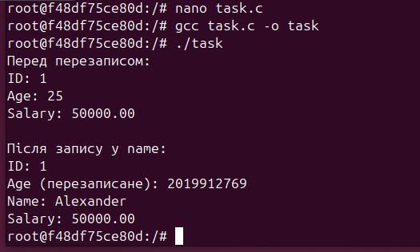

# Завдання (Варіант №23)
**Умова**
> Побудуйте приклад, в якому частина структури перезаписується через змінний union — і ця помилка не є очевидною при огляді коду.
# Хід роботи
Було реалізовано програму, в якій визначено структуру Data з вкладеним union info, що містить два поля — age (ціле число) та name (рядок символів). Спочатку у union записується значення віку, після чого в поле name записується строка. Оскільки union накладає усі свої поля на одну ділянку пам'яті, запис у name перезаписує значення age. У результаті поле age містить неочікуване значення, що демонструє типову помилку з пошкодженням пам'яті.
Згідно теорії, таке перезаписування частини структури через union належить до класу memory corruption, оскільки відбувається неявна зміна даних через накладання полів. Подібні помилки дуже важко виявляються при тестуванні, якщо не використовуються спеціальні інструменти (наприклад, valgrind, sanitizers).

## **Результат роботи**

Даний приклад демонструє, що при використанні union необхідно бути обережним, оскільки всі його поля мають спільну пам’ять, і запис в одне з полів автоматично призводить до зміни інших полів. Це створює ризик пошкодження даних, які важко відстежити без спеціальних інструментів діагностики.
