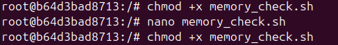
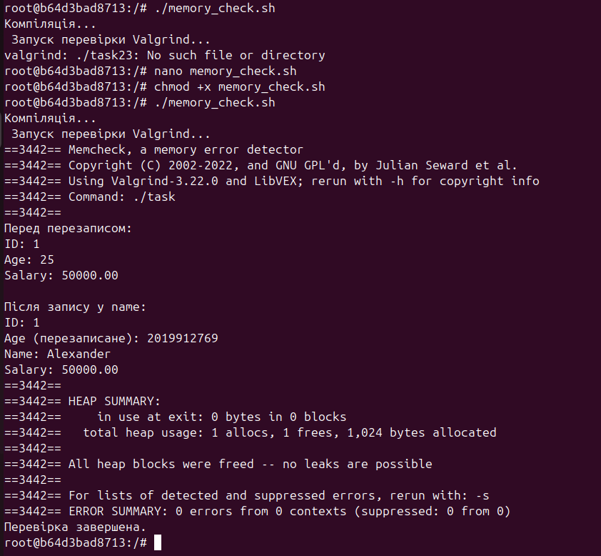

# Завдання (Варіант 23)
**Умова**
> Реалізуйте інтеграцію обох інструментів у CI-пайплайн через GitHub Actions або shell-скрипт.
**Хід роботи**
Для автоматизації компіляції та перевірки програми на помилки роботи з пам’яттю був створений shell-скрипт memory_check.sh, який послідовно виконує збірку коду за допомогою gcc, а потім перевіряє програму з використанням valgrind. Скрипт дозволяє проводити повний цикл тестування після кожної зміни коду.
Було створено файл task.c з кодом програми з Практичної роботи №5. Створено shell-скрипт memory_check.sh зі змістом:
>#!/bin/bash
>set -e
>echo "Компіляція..."
>gcc -g task23.c -o task23
>echo "Запуск перевірки Valgrind..."
>valgrind --leak-check=full ./task23
>echo "Перевірка завершена."
Надано права на виконання > chmod +x memory_check.sh
Та запущено скрипт.

## **Результат роботи**

