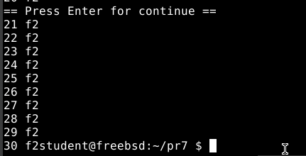

# Завдання 1
**Умова**
> Використайте popen(), щоб передати вивід команди rwho (команда UNIX) до more (команда UNIX) у програмі на C.
# Пояснення
Ця програма показує, як використовувати функцію popen() для з’єднання двох команд UNIX, rwho і more, так само, як це робиться в конвеєрі rwho | more в командному рядку.  Програма відкриває два потоки. Перший використовується для читання виводу команди rwho, яка показує список користувачів, які зараз увійшли до системи. Другий потік використовується для запису у вхідний потік команди more, яка виводить текст порціями, що зручно переглядати довгі списки.  Програма читає рядки з виводу rwho у буфер і передає їх у more за допомогою циклу while.  Нарешті обидва потоки закриваються pclose().

**Результат роботи**

# Завдання 2
**Умова**
>Напишіть програму мовою C, яка імітує команду ls -l в UNIX — виводить список усіх файлів у поточному каталозі та перелічує права доступу тощо. (Варіант вирішення, що просто виконує ls -l із вашої програми, — не підходить.)
# Пояснення
Ця програма самостійно збирає та виводить всю необхідну інформацію про файли в поточному каталозі, імітуючи команду ls -l у UNIX без виклику зовнішньої команди.  Вона використовує функцію opendir("."), щоб відкрити поточний каталог, а потім читає кожен файл або підкаталог за допомогою readdir().  Стандартні знаки "." і ".." не використовуються.  lstat() використовується для отримання характеристик кожного об'єкта, таких як тип, права доступу, кількість жорстких посилань, ідентифікатори власника та групи, розмір, час останньої модифікації. Функція print_mode() створить pядок прав доступу, схожий на формат -rwxr-xr--, але перший символ показує тип об'єкта (наприклад, d — директорія, — звичайний файл, — символьне посилання), а решта символів показує права користувача, групи тощо.  Функції getpwuid() та getgrgid() використовуються для пошуку імен користувача та груп.  У файлі виводиться розмір у байтах, а час модифікації форматується за допомогою strftime() як місяць, день, година:хвилина.  Нарешті, ім’я об’єкта виводиться, а якщо це символьне посилання, додатково показується шлях, на який воно вказує, за допомогою readlink().  У поєднанні це створює вивід, максимально схожий на ls -l.

**Результат роботи**

# Завдання 3
**Умова**
>Напишіть програму, яка друкує рядки з файлу, що містять слово, передане як аргумент програми (проста версія утиліти grep в UNIX).
# Пояснення
Ця помилка є менш складною версією команди grep на UNIX.  Вона приймає два аргументи з командного рядка: слово, яке потрібно знайти, і назва файлу, який потрібно знайти.  Програма спочатку перевіряє, чи передано лише два аргументи, не враховуючи імені програми.  Якщо це не так, програма завершується кодом помилки та виводиться повідомлення про правильний формат виклику.  Далі програма відкриває файл і дозволяє читати його. Якщо файл не можна відкрити (наприклад, через брак або відсутність прав доступу), виводиться повідомлення про помилку і програма завершується.  Програма читає файл по рядкам, якщо файл відкрито успішно.  Виконується перевірка кожного рядка; якщо рядок містить передане слово (за допомогою функції strstr()), рядок відображається на екрані.  Нарешті файл закривається, а програма закривається.  За допомогою цього методу можна ефективно знаходити інформацію у великих текстових файлах, не використовуючи зайвих обчислень.

**Результат роботи**

**Текстовий файл**

# Завдання 4
**Умова**
>Напишіть програму, яка виводить список файлів, заданих у вигляді аргументів, з зупинкою кожні 20 рядків, доки не буде натиснута клавіша (спрощена версія утиліти more в UNIX).
# Пояснення
Ця програма є менш складною версією утиліти more, яка використовується для посторінкового перегляду вмісту текстових файлів.  Вона виводить вміст одного або кількох файлів і призупиняє вивід після 20 рядків, очікуючи натискання клавіші Enter, перш ніж перейти на наступну «сторінку».

 Спочатку функція main перевіряє, чи передано хоча б один аргумент командного рядка, або назву файлу.  Програма повідомляє правильний формат запуску та завершує роботу з кодом помилки, якщо жодного файлу не передано.

 Далі програма використовує цикл для проходження по всіх переданих аргументах або файлах і викликає функцію show_file для кожного з них.  Перед виведенням вмісту кожен файл має заголовок із назвою, щоб користувач міг зрозуміти, з якого файлу йде вивід.
Можна відкрити файл у режимі читання за допомогою функції show_file.  Якщо файл не може бути відкрити (наприклад, якщо він не існує), використовується perror, щоб вивести повідомлення про помилку, а потім функція повертається.

 Fgets читає файл по стрічці.  За допомогою fputs кожен зчитаний рядок відразу виводиться на екран.  Лічильник line_count визначає кількість рядків, які були виведені.  Коли значення 20 досягається макросом LINES_PER_PAGE, програма зупиняє вивід і видає запрошення: == Натисніть Enter, щоб продовжити.  Після натискання Enter, яке обробляється циклом getchar(), лічильник рядків обнуляється, і вивід починається з наступної сторінки.

 Після завершення читання всього файлу використовується функція fclose для закриття файлу.

 Таким чином, ця програма легко виводить довгі файли, не заповнюючи одразу весь екран текстом. Це дозволяє користувачеві поступово переглядати вміст, натискаючи Enter, щоб перейти до наступної частини.

 **Результат роботи**

# Завдання 5
**Умова**
>Напишіть програму, яка перелічує всі файли в поточному каталозі та всі файли в підкаталогах.
# Пояснення
Цей програмний продукт розроблений для повторного переліку всіх файлів у поточному каталозі та всіх його підкаталогах.  Вона виводить повні шляхи до всіх файлів у вказаній директорії та її вкладених каталогах, як і команда find. -type f.

 Функція list_directory викликається у функції main, надаючи їй позначення поточного каталогу ".".  Це означає, що перелік починається з директорії програми.

 Функція list_directory використовує opendir для відкриття каталогу.  Якщо каталог не вдалося відкрити (наприклад, через відсутність дозволів), створюється повідомлення про помилку з поясненням, отриманим через strerror(errno).

 Після успішного відкриття каталогу програма виводить назву поточної директорії. Потім вона використовує readdir для читання всіх записів у каталозі в циклі.  Кожен запис є структурою dirent, яка містить назву файлу або підкаталогу.
 Щоб запобігти нескінченній рекурсії, записи «.» і «.» (поточна та батьківська директорії) пропускаються.

 snprintf створює повний шлях до елемента для кожного іншого запису. Це поєднує шлях поточної директорії та назву запису.

 Далі функція stat отримує дані про файл або каталог.  Якщо stat завершується з помилкою, виводиться повідомлення про помилку, і процес переходить до наступного елемента.

 Якщо елемент є директорією, що перевіряється за допомогою S_ISDIR(st.st_mode), функція list_directory викликається повторно для цього підкаталогу.  Інакше, якщо це звичайний файл, буде виведений повний шлях до файлу.

 Коли всі записи оброблені, closedir використовується для закриття директорії.

 Таким чином, програма повністю обходить файлову ієрархію, починаючи з поточного каталогу та виводячи шляхи до всіх файлів, які вона знаходить.  Обхід будь-якої глибини вкладених підкаталогів забезпечується рекурсією.

 **Результат роботи**

# Завдання 6
**Умова**
>Напишіть програму, яка перелічує лише підкаталоги у алфавітному порядку.
# Пояснення
  Цей програмний продукт призначений для виведення списку всіх підкаталогів у поточному каталозі в алфавітному порядку.  Вона починає роботу, відкривши поточну директорію за допомогою функції opendir.  Якщо каталог не можна відкрити (наприклад, через відсутність дозволу), програма виводить повідомлення про помилку та завершує роботу.  Далі за допомогою readdir програма послідовно читає всі записи в каталозі.  Щоб запобігти зацикленню, записи з іменами "." та.." (які відповідають поточному та батьківському каталогам) пропускаються.
  Програма створює повний шлях для кожного іншого запису, поєднуючи поточний каталог «./» з іменем елемента, який було знайдено.  Далі вона перевіряє, чи є цей об’єкт підкаталогом, використовуючи функцію stat.  Якщо це так, його ім’я буде включено до динамічного рядка.  На початку для зберігання імен каталогів виділяється пам’ять на певну кількість елементів. Потім Realloc автоматично розширює масив, якщо він заповнюється.  Функція strdup створює копію рядка, зберігаючи кожне ім’я окремо.
Після завершення читання каталогу стандартна функція qsort використовується для порівняння допоміжної функції, що викликає strcmp, щоб сортувати всі зібрані імена каталогів у алфавітному порядку.  Після сортування програма додасть символ/наприкінці до кожного імені каталогу, щоб чітко показати, що це каталог.  Нарешті, пам’ять, виділена під масив імен і кожен рядок, звільняється.
 Таким чином, програма формує список підкаталогів у поточній директорії та виводить його в зрозумілому та впорядкованому вигляді.

  **Результат роботи**

# Завдання 7
**Умова**
>Напишіть програму, яка показує користувачу всі його/її вихідні програми на C, а потім в інтерактивному режимі запитує, чи потрібно надати іншим дозвіл на читання (read permission); у разі ствердної відповіді — такий дозвіл повинен бути наданий.
# Пояснення
Ця програма розроблена для пошуку всіх виконуваних файлів поточного користувача в його каталозі.  Програма знаходить назву кожного такого файлу і запитує користувача, чи потрібно дозволити іншим користувачам читати його.  Програма змінює права доступу до файлу, надаючи іншим (інші) дозвіл на читання, якщо користувач підтверджує, відповідаючи «y» або «Y».  В іншому випадку вона не візьме участь у цьому файлі.

 Запуск програми починається з відкриття поточного каталогу за допомогою opendir.  Якщо каталог не вдалося відкрити, виникає повідомлення про помилку та програма завершується.  Після цього в циклі використовується readdir для читання всіх записів каталогу.  Записи "." і.., які відповідають поточному та батьківському каталогам, пропускаються.
 Функція is_executable_owned використовується для перевірки всіх інших записів.  Ця функція виконує системний виклик stat, щоб отримати інформацію про файл. Він визначає, чи це звичайний файл, чи встановлено для нього право виконання власником, і чи належить файл поточному користувачу (перевіряється зіставлення власника файлу та ідентифікатора користувача, що запустив програму).  Файл вважається виконуваною програмою власника, якщо всі ці умови виконуються.
 Функція process_file використовується для кожного з цих файлів, яка знову виконує stat для отримання поточних прав доступу.  Після цього програма запитує користувача, чи хоче він дозволити іншим людям читати файл.  Функція chmod змінює права доступу користувача, якщо він вводить «y» або «Y». Біт S_IROTH додається до існуючих прав, що дозволяє іншим користувачам читати.  Операція завершується повідомленням про успішне надання дозволу.  Файл пропускається, якщо користувач відповідає інакше або не вводить нічого.
 Після завершення обробки кожного файлу відкритий каталог закривається, і програма завершується.
 Таким чином, ця програма автоматизує перевірку файлів, які зараз виконуються власником у поточному каталозі, і дозволяє іншим користувачам швидко читати файли в інтерактивному режимі, що може бути корисно, наприклад, для спільного доступу до власних програм.

   **Результат роботи**

# Завдання 8
**Умова**
>Напишіть програму, яка надає користувачу можливість видалити будь-який або всі файли у поточному робочому каталозі. Має з’являтися ім’я файлу з запитом, чи слід його видалити.
# Пояснення
Користувач може вибірково видаляти файли з поточного робочого каталогу за допомогою цієї програми.  У першу чергу програма використовує функцію opendir для відкриття поточного каталогу.  Якщо відкрити каталог не вдається, виводиться повідомлення про помилку і програма завершує роботу.
 Далі цикл використовує readdir для послідовного читання всіх записів каталогу.  Щоб запобігти непотрібним операціям із поточним і батьківським каталогами, імена записів «.» і «.» пропускаються.  Викликаючи функцію is_regular_file для кожного іншого запису, програма перевіряє, чи є запис звичайним файлом. Ця функція визначає тип файлу за допомогою stat.
 Якщо файл звичайний, користувачеві виводиться запит на ім'я файлу та пропонується вибрати один із трьох варіантів: видалити файл (y), пропустити файл (n) або видалити всі файли (a).  Програма отримує повідомлення користувача з консолі.
 Якщо користувач вводить букву Y або Y, функція видалення буде використана для видалення файлу.  У випадку успішного видалення виводиться повідомлення, а у випадку помилки виводиться повідомлення про помилку.  Файл пропускається, якщо користувач вводить n або іншу відповідь.
 Якщо користувач вказує "a" або "A", щоб вказати, що він хоче видалити всі файли, програма автоматично видаляє всі наступні файли в каталозі, не запитуючи повторного підтвердження.  Однак у цьому блоку наданого коду використовується опція «всі». Однак у коментарі в кінці зазначено, що вона не використовується в кінцевому результаті, оскільки така функція може бути небезпечною та призвести до випадкової втрати файлів.
 Таким чином, програма інтерактивно дозволяє користувачу вибирати, які файли видалити, і дозволяє безпечно контролювати процес видалення без автоматичної втрати всіх файлів у каталозі.

  **Результат роботи**

# Завдання 9
**Умова**
>Напишіть програму на C, яка вимірює час виконання фрагмента коду в мілісекундах.
# Пояснення
Ця програма призначена для вимірювання часу виконання окремого фрагмента коду в мілісекундах.  Для отримання точного часу до та після виконання коду вона використовує функцію gettimeofday.
 Спочатку визначається допоміжна функція time_diff_ms, яка приймає початкову та кінцеву структури типу timeval.  Ця функція обчислює різницю в мілісекундах між ними.  Вона обчислює різницю між двома параметрами, відомими як tv_sec та tv_usec, переводить секунди у мілісекунди та додає мілісекунди, отримані з мікросекундної частини.
 Спочатку функція main виконує виклик gettimeofday(&start, NULL), щоб визначити час початку вимірювання.  Після цього виконується сам фрагмент коду, для якого необхідно визначити час виконання. У цьому випадку це порожній цикл, який ітерується 100 мільйонів разів.  Ключове слово volatile використовується у змінній циклі, щоб компілятор не оптимізував цей цикл і не прибрав його як непотрібний.
 Після завершення циклу використовується gettimeofday(&end, NULL) для визначення часу закінчення виконання.
 Нарешті викликається функція time_diff_ms, яка вимірює різницю між початковим і кінцевим часом і показує результат у мілісекундах на екрані.
 Таким чином, ця програма наочно показує, як виміряти час виконання коду з точністю до мілісекунд, що корисно для оптимізації та профілювання продуктивності.

   **Результат роботи**

# Завдання 10
**Умова**
>Напишіть програму мовою C для створення послідовності випадкових чисел з плаваючою комою у діапазонах: (a) від 0.0 до 1.0 (b) від 0.0 до n, де n — будь-яке дійсне число з плаваючою точкою. Початкове значення генератора випадкових чисел має бути встановлене так, щоб гарантувати унікальну послідовність. Примітка: використання прапорця -Wall під час компіляції є обов’язковим.
# Пояснення
Ця програма генерує послідовність випадкових чисел з плаваючою крапкою в двох діапазонах: від 0.0 до 1.0 і від 0.0 до будь-якого додаткового числа n, яке можна надати програмі як аргумент командного рядка.
 У першу чергу визначено дві функції.  Випадкове число в діапазоні від 0.0 до 1.0 повертається першим, rand_0_1().  Це досягається за допомогою стандартної функції rand(), яка повертає ціле випадкове число в діапазоні від 0 до RAND_MAX.  Випадкове число з плаваючою точкою в діапазоні від 0.0 до 1.0 можна отримати, розділивши це значення на RAND_MAX і перетворивши його на тип float.
 Випадкове число може бути створено другою функцією, rand_0_n(float n), яка працює в діапазоні від 0.0 до n.  Вона просто множить на значення n результат функції rand_0_1.
 У функції основної перевіряється, чи передається аргумент командного рядка.  Якщо це так, atof() перетворює його в число з плаваючою точкою.  Якщо значення n не додається, виводиться повідомлення про помилку, і програма завершується з кодом невдачі.
 Далі виклик srand() використовується для запуску генератора випадкових чисел, надаючи поточний час у секундах як початкове значення (сеед).  Це гарантує, що при кожному запуску програми виникає унікальна послідовність випадкових чисел.
 Після цього виводяться п’ять випадкових чисел у діапазоні від 0.0 до 1.0, а також п’ять чисел у діапазоні від 0.0 до n із точністю до шести знаків після коми.
 Прапорець -Wall використовується при компіляції програми, щоб увімкнути максимальну кількість попереджень компілятора, що допомагає уникати помилок і попереджень у коді.

   **Результат запуску програмиз параметром та без нього**

# Завдання за варіантом (Варіант 23)
**Умова**
>Створіть програму, яка моделює втрату зв’язку з файловою системою і відновлення після неї (у межах звичайного користувача).
# Пояснення
Було реалізовано програму, яка моделює втрату доступу до ресурсу файлової системи (файл data.txt) під час виконання. Програма намагається прочитати файл, фіксує його відсутність як помилку, зупиняється, потім повторно пробує доступ після відновлення. Таким чином змодельовано типову ситуацію втрати зв’язку з ресурсом у реальних системах, не виходячи за межі прав звичайного користувача.

**Результат роботи у випадку успішного знаходження файлу**

**Результат роботи імітації втрати файлу**

