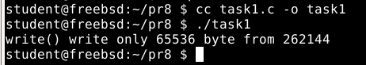
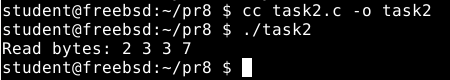
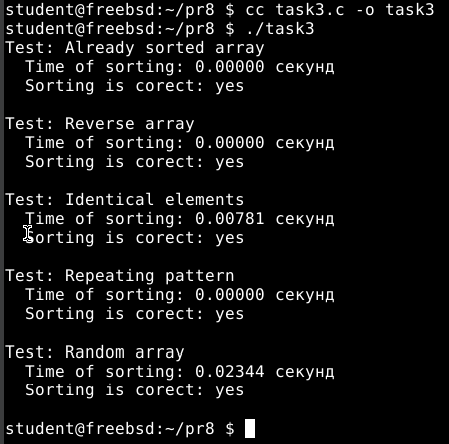
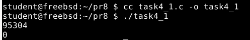
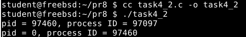
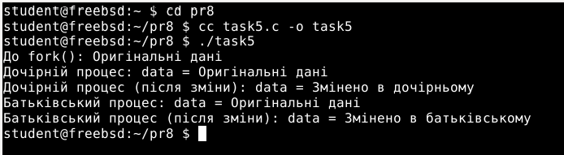

# Завдання 1
**Умова**
>Чи може виклик count = write(fd, buffer, nbytes); повернути в змінній count значення, відмінне від nbytes? Якщо так, то чому? Наведіть робочий приклад програми, яка демонструє вашу відповідь.
# Пояснення
Так, виклик write(fd, buffer, nbytes) здатний повернути значення менше nbytes.  Це пов’язано з тим, що функція write не може гарантувати запис усіх байтів за один раз.  Це особливо стосується пристроїв з обмеженим буфером, таких як трубки та сокети, а також у випадках, коли дескриптор відкритий у неблокуючому режимі (O_NONBLOCK).  У цьому випадку write записує лише кількість байт, яку пристрій може відразу помістити у внутрішній буфер, і повертає число байт, які насправді записані.  Якщо залишок даних не поміщається, write повертає менше nbytes, і програмі потрібно викликати write ще раз, щоб записати залишок даних.
У наведеній програмі створюється трубка, яка переводить записуючий дескриптор у неблокуючий режим.  Після цього система намагається записати великий буфер розміром 256 КБ у трубку.  Письмовий запис поверне лише стільки байт, скільки помістилося у буфері, оскільки внутрішній буфер трубки зазвичай має розмір приблизно 64 КБ.  Це показує, що write може повертати значення, а не nbytes.
 Таким чином, через обмеження розміру буфера пристрою та режиму неблокуючого вводу-виводу функція write може записати менше даних, ніж вимагається.  Це нормальна поведінка, яку враховують при програмуванні.  Прикладом такої ситуації є програма, яку ви навели.

 **Результат запуску програми**
 

# Завдання 2
**Умова**
> Є файл, дескриптор якого — fd. Файл містить таку послідовність байтів: 4, 5, 2, 2, 3, 3, 7, 9, 1, 5. У програмі виконується наступна послідовність системних викликів:
lseek(fd, 3, SEEK_SET);
read(fd, &buffer, 4);
де виклик lseek переміщує покажчик на третій байт файлу. Що буде містити буфер після завершення виклику read? Наведіть робочий приклад програми, яка демонструє вашу відповідь.
# Пояснення
Файл містить послідовність байтів: 4, 5, 2, 2, 3, 3, 7, 9, 1, 5. Виклик системної фyнкції lseek(fd, 3, SEEK_SET) переміщує файловий покажчик на третій байт файлу, тобто на четвертий за порядком байт, який має значення 2, оскільки індексація починається з нуля.  Далі виклик read(fd, &buffer, 4) зчитує чотири байти починаючи з позиції 3, що призводить до того, що байти з індексами 3, 4, 5 і 6 потраплять у буфер, які є відповідно 2, 3, 3 і 7.  Таким чином, коли читання буде завершено, у буфері будуть значення 2, 3, 3, 7.
 Програма, яка демонструє цю поведінку, спочатку створює файл із визначеною послідовністю байтів, потім відкриває файл, встановлює позицію читання на третій байт і читає чотири байти у буфер.  Після цього програма виводить повідомлення, які були прочитані.  При виконанні буде виділено рядок, який каже: «Читати байти: 2 3 3 7». Це підтверджує описану поведінку.

  **Результат запуску програми**
  

# Завдання 3
**Умова**
> Бібліотечна функція qsort призначена для сортування даних будь-якого типу. Для її роботи необхідно підготувати функцію порівняння, яка викликається з qsort кожного разу, коли потрібно порівняти два значення. Оскільки значення можуть мати будь-який тип, у функцію порівняння передаються два вказівники типу void* на елементи, що порівнюються.
>Напишіть програму, яка досліджує, які вхідні дані є найгіршими для алгоритму швидкого сортування. Спробуйте знайти кілька масивів даних, які змушують qsort працювати якнайповільніше. Автоматизуйте процес експериментування так, щоб підбір і аналіз вхідних даних виконувалися самостійно.
>Придумайте і реалізуйте набір тестів для перевірки правильності функції qsort.

# Пояснення
Алгоритм швидкого сортування, який зазвичай працює за часом приблизно O(n log n), реалізується функцією qsort у стaндартній бібліотеці C.  Тим не менш, у найгіршому сценарії, коли вибір опорного елемента неефективний (наприклад, коли масив вже відсортований або відсортований у зворотному порядку і крайній елемент обраний як опорний елемент), час роботи може зрости до квадратичного числа O(n2).  У програмі створюються різні типи масивів, включаючи випадковий масив, впорядкований за зростанням, впорядкований у зворотному напрямку, масив із однаковими елементами та масив із циклічно повторюваним патерном, щоб визначити найгірші вхідні дані для qsort.  Сортування за допомогою qsort виконується для кожного з цих масив, а потім вимірюється час роботи функції, щоб переконатися, що масив дійсно відсортований. Функція порівняння порівнює два цілі числа, передані як вказівники void*. Це стандартний метод для універсальної функції порівняння, необхідної для qsort.
 У процесі тестування визначається тип вхідних даних, який викликає найбільший час роботи qsort, що фактично є найгіршим випадком.  Найчастіше це масив, який вже відсортований або масив, відсортований у зворотному напрямку, залежно від того, як виконується функція.  Масив із однаковими елементами також може бути проблемним, якщо реалізація не оптимізована для таких випадків.
Автоматизація включає виділення масиву пам'яті для кожного типу вхідних даних, заповнення його відповідними значеннями, запуск сортування, встановлення часу роботи та перевірку правильності сортування.  Для нагляду результати виводяться на екран.  Завдяки цьому не тільки можна знайти найгірші випадки, але й можна перевірити правильність роботи функції qsort на різних вхідних даних.
 Таким чином, цей метод дозволяє визначити типи вхідних даних, які негативно впливають на швидкість сортування, а також автоматично перевіряти правильність роботи функції сортування в різних сценаріях. Це робить програму універсальним інструментом для аналізу та перевірки функції qsort.
 
   **Результат запуску програми**
  

# Завдання 4
**Умова**
>Виконайте наступну програму на мові програмування С: int main() { int pid; pid = fork(); printf("%d\n", pid); } Завершіть цю програму. Припускаючи, що виклик fork() був успішним, яким може бути результат виконання цієї програми?
# Пояснення
Програма запускає системний виклик fork(), який створює новий процес.  Значення, яке зберігається у змінній pid після виклику fork(), дозволяє відрізнити батьківський процес pid від дочірнього процесу. У батьківському процесі pid міститься ідентифікатор дочірнього процесу (позитивне число), у дочірньому процесі - 0, а у дочірньому процесі зберігається значення від’ємного числа при помилці.  Програма перевіряє успіх fork() і виводить рядок із інформацією про pid та власний ідентифікатор процесу (отриманий за допомогою getpid()).  Команда printf виконується двічі в батьківському і дочірньому процесах, оскільки fork() створює два процеси. У результаті в консолі з’являться два рядки.  Бо процеси виконуються паралельно, вони можуть виводитися у будь-якому порядку, і порядок виводу залежить від планування операційної системи. У першому рядку pid = 0 і процесний ідентифікатор дорівнює ідентифікатору дочірнього процесу. У другому рядку pid містить PID дочірнього процесу, а процесний ідентифікатор дорівнює PID батьківського процесу.  Виклик fork() викликає повідомлення про помилку.  Запуск програми виведе два рядки з інформацією про процеси. Ці рядки показують створення дочірнього процесу та результат роботи fork().

   **Результат запуску початкової програми**
  

   **Результат запуску фінальної програми**
   

# Завдання за варіантом (Варіант 23)
**Умова**
>Побудуйте схему аналізу фрагментів пам’яті, виділених через malloc(), при одночасному fork() і зміні значень.
# Пояснення
Програма демонструє особливості роботи з динамічною пам’яттю, виділеною через malloc(), у контексті створення нового процесу за допомогою fork() та подальшої модифікації значень у пам’яті.

На початку програма виділяє 100 байтів памʼяті у heap за допомогою функції malloc() і записує туди рядок "Оригінальні дані". Ці дані одразу виводяться на екран — це стан пам’яті до виклику fork().

Після цього виконується fork() — створюється дочірній процес, який отримує копію памʼяті батьківського процесу. Обидва процеси (батьківський і дочірній) далі виконуються незалежно. Першим працює дочірній процес (за допомогою затримки sleep(1) у батьківському процесі).

У дочірньому процесі дані, які були у памʼяті ("Оригінальні дані"), замінюються на "Змінено в дочірньому", після чого виводиться нове значення.

Після завершення роботи дочірнього процесу активується батьківський процес. Він знову виводить змінну data (і бачить у ній "Оригінальні дані"), що підтверджує незалежність змін у процесах. Потім батьківський процес змінює значення у своїй копії пам’яті на "Змінено в батьківському" і також виводить результат.

Це означає, що обидва процеси мають свої окремі копії виділеної пам’яті, які поводяться незалежно після fork().

   **Результат запуску програми**
  

