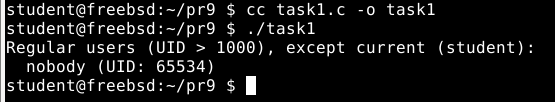
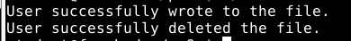
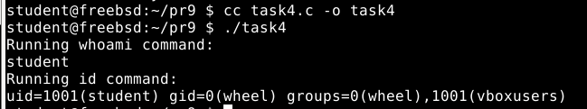
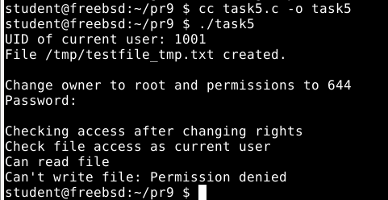
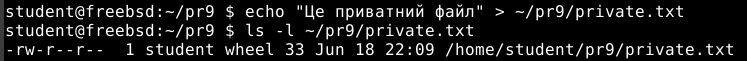
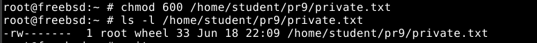
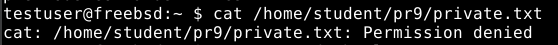
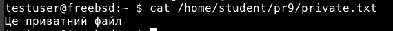

# Завдання 1
**Умова**
>Напишіть програму, яка читає файл /etc/passwd за допомогою команди getent passwd, щоб дізнатись, які облікові записи визначені на вашому комп’ютері. Програма повинна визначити, чи є серед них звичайні користувачі (ідентифікатори UID повинні бути більші за 500 або 1000, залежно від вашого дистрибутива), окрім вас.
# Пояснення
Ця програма призначена для того, щоб визначити звичайних користувачів, зареєстрованих у системі, за винятком поточного користувача. Вона використовує команду getent passwd, яка виводить список усіх користувачів, подібно до вмісту файлу /etc/passwd. На початку програма визначає UID поточного користувача за допомогою функції getuid(), після чого за цим UID отримує структуру passwd, що містить інформацію про користувача. Із цієї структури витягується ім’я поточного користувача, щоб пізніше виключити його зі списку. UID (User ID) є унікальним числовим ідентифікатором кожного користувача в системі, і звичайні користувачі мають UID від 1000 і вище. Далі програма отримує повний список усіх користувачів системи. Рядок розбивається на частини за роздільником : — це дозволяє виділити ім’я користувача та його UID. UID перетворюється з рядка у число, після чого програма перевіряє, чи цей UID більший або рівний 1000 та чи не збігається ім’я користувача з ім’ям поточного користувача. Якщо обидві умови виконуються, програма виводить ім’я такого користувача та його UID.

**Результат виконання програми**

# Завдання 2
**Умова**
>Напишіть програму, яка виконує команду cat /etc/shadow від імені адміністратора, хоча запускається від звичайного користувача. (Ваша програма повинна робити необхідне, виходячи з того, що конфігурація системи дозволяє отримувати адміністративний доступ за допомогою відповідної команди.)
# Пояснення
Команда sudo cat /etc/master.passwd виконується для виведення вмісту файлу /etc/master.passwd.  Ця папка містить додаткову інформацію про користувачів, включаючи захищені паролі.  Зазвичай для доступу до цього файлу потрібні права суперкористувача, тому команда виконується за допомогою sudo.  У програмі є функція system(), яка дозволяє запустити команду в іншому процесі.  Змінна ret містить результати виконання цієї команди.  Після цього програма перевіряє, чи завершився виклик system() з помилкою. Якщо повернене значення дорівнює -1, perror() виводить повідомлення про помилку, і програма завершується з кодом 1, що означає помилку.  Якщо system() спрацював, але команда завершилася з ненульовим кодом повернення, програма використовує макроси WIFEXITED() та WEXITSTATUS(), щоб дізнатися, чи завершився процес правильно та який код виходу. Якщо команда завершилась із помилкою, виводиться повідомлення, що команда не спрацювала, можливо, через нестачу прав (Maybe need privilegies sudo.), повідомляючи користувачу, що слід перевірити, чи були надані відповідні права доступу. Для запуску цієї програми від звичайного користувача я прописував команди user ALL=(ALL) NOPASSWD: /home/user/main/PR9/task2 та user ALL=(ALL) NOPASSWD: /bin/cat /etc/master.passwd в visudo через rootа для коректного запуску та роботи програми.

**Результат виконання програми**

# Завдання 3
**Умова**
>Напишіть програму, яка від імені root копіює файл, який вона перед цим створила від імені звичайного користувача. Потім вона повинна помістити копію у домашній каталог звичайного користувача. Далі, використовуючи звичайний обліковий запис, програма намагається змінити файл і зберегти зміни. Що відбудеться? Після цього програма намагається видалити цей файл за допомогою команди rm. Що відбудеться?
# Пояснення
Ця програма показує, як процес у системі з правами root може змінити ефективний UID на тимчасовий термін, щоб діяти від імені іншого користувача, а потім повернути права root.  Вона також демонструє, як створюються файли від імені різних користувачів, як виконується передача прав власності на файл і як обмеження доступу залежать від правового контексту процесу.  На початку програми задається UID користувача (UID 1001), який потрібно тимчасово імітувати, і домашня директорія користувача.  Далі створюється тимчасовий файл /tmp/testfile_root.txt, у якому записується рядок «Здрастуй, користуваче root».  Оскільки програма на цьому етапі ще має повні привілеї, стандартне створення файлу з правами root виконується легко.  Після цього за допомогою seteuid змінюється UID на 1001. Таким чином, процес працює від імені цього користувача тимчасово.  Під новим UID створюється новий файл /tmp/testfile_user.txt, у якому записується рядок «Здрастуй, користувач».  Це показує, що навіть якщо програма має права root на початку, вона може безпечно виконувати дії від імені іншого користувача, змінюючи лише UID.  За допомогою seteuid(0) процес повертає собі права root після завершення створення файлу під UID користувача.  Далі програма використовує snprintf для створення шляху до файлу, який користувач створив, і копіює його до іншого файлу в домашній директорії користувача.  Для цього файл-джерело /tmp/testfile_user.txt відкривається для читання, а також файл-призначення copied_file.txt створюється для запису в домашній директорії. Програма виконує функцію chown(), яка змінює власника файлу на UID користувача, щоб переконатися, що новостворений файл належить користувачу, від імені якого він був запущений.  Після цього UID користувача знову змінюється на його UID, і програма намагається відкрити новий файл copied_file.txt для дописування.  Якщо відкриття не вдається, наприклад через недостатні права, програма виведе повідомлення про помилку.  Якщо відкриття успішне, користувач дописує до файлу рядок «Користувач додав цю лінію».  Після завершення процесу програма видаляє файл.

**Результат виконання програми**

# Завдання 4
**Умова**
>Напишіть програму, яка по черзі виконує команди whoami та id, щоб перевірити стан облікового запису користувача, від імені якого вона запущена. Є ймовірність, що команда id виведе список різних груп, до яких ви належите. Програма повинна це продемонструвати.
# Пояснення
Програма використовує дві системні команди whoami та id, щоб визначити, під яким користувачем запущено програму та які ідентифікатори в ній.  Вона контролює результати всіх команд.  Виводиться повідомлення про помилку, якщо будь-яка з них не була виконана.

**Результат виконання програми**

# Завдання 5
**Умова**
>Напишіть програму, яка створює тимчасовий файл від імені звичайного користувача. Потім від імені суперкористувача використовує команди chown і chmod, щоб змінити тип володіння та права доступу. Програма повинна визначити, в яких випадках вона може виконувати читання та запис файлу, використовуючи свій обліковий запис.
# Пояснення
Цей програмний код створює файл /tmp/testfile_tmp.txt, який має лише права запису та читання власника (0600), записує в ньому текст і виводить UID користувача, який його використовує.  Після цього за допомогою sudo змінює власника файлу на root:wheel і права на 644. Далі він перевіряє доступ до файлу більш детально, спочатку для читання, потім для запису, використовуючи access(), і вказує помилку через strerror(errno), якщо доступ закритий.  У випадку, якщо ви хочете, щоб ця програма працювала у visudo, вам потрібно встановити параметри user ALL=(ALL) NOPASSWD: /usr/sbin/chown, /bin/chmod.

**Результат виконання програми**

# Завдання 6
**Умова**
>Напишіть програму, яка виконує команду ls -l, щоб переглянути власника і права доступу до файлів у своєму домашньому каталозі, в /usr/bin та в /etc. Продемонструйте, як ваша програма намагається обійти різні власники та права доступу користувачів, а також здійснює спроби читання, запису та виконання цих файлів.
# Пояснення
Ця програма демонструє кілька способів перевірки прав доступу для різних файлів і директорій. Спочатку в main() вона виводить на екран поточний список файлів у домашній теці користувача (ls -l ~), у /usr/bin та у /etc (по десять перших записів кожного), щоб швидко побачити типи файлів, їх власників, групи і набір прав (rwx) для кожного. Далі викликається функція test_file_access() для кількох ключових файлів: – /etc/passwd, який доступний для читання всім і містить інформацію про користувачів; – /etc/shadow, який містить захешовані паролі і доступ до нього заборонено звичайним користувачам; – /usr/bin/ls і /usr/bin/cc, виконувані файли системи.

# Завдання за варіантом (Варіант 23)
**Умова**
>Виконайте серію дій з chown, щоб об'єкт мав змішані права доступу у різних процесів.
# Пояснення
Метою завдання було продемонструвати використання команди chown для налаштування змішаних прав доступу до одного об’єкта з боку різних процесів (користувачів). У ході виконання було створено файл private.txt у домашньому каталозі користувача student. Після створення файл мав власника student і стандартні права доступу 644, тобто був доступний для читання іншим користувачам).

Далі власником файлу було зроблено root за допомогою команди chown root:wheel, після чого користувач student більше не мав повного контролю над файлом. Було встановлено обмеження на читання і запис виключно для власника (chmod 600), що повністю заборонило доступ до файлу будь-яким іншим користувачам системи. Це підтверджується відповідним виводом ls -l, де права змінено на -rw-------, а власником вказано root.

Після цього в системі було створено нового користувача з ім’ям testuser. Коли цей користувач намагався прочитати файл за допомогою команди cat, система повернула повідомлення Permission denied, що підтверджує відсутність прав доступу.

Щоб надати доступ користувачу testuser, його було додано до групи wheel, до якої також належить файл private.txt. Права файлу було змінено на 640 (chmod 640), що дозволило членам групи читати файл. Після цього testuser успішно прочитав вміст файлу, хоча й не є його власником.

Таким чином, файл private.txt виявився недоступним для одного користувача (до зміни прав), і доступним для іншого, завдяки його належності до відповідної групи. Це демонструє гнучку систему контролю доступу в Unix-подібних системах, де доступ регулюється не тільки через користувача, але й через групи та права на читання, запис і виконання. Завдання наочно ілюструє, як одна й та сама операція з файлом може дати різний результат залежно від контексту запуску програми або користувача, що її виконує.
